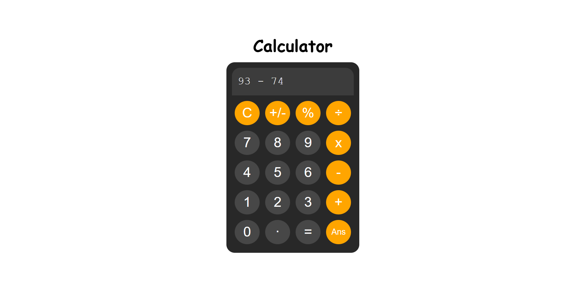

# Calculator 🖩

A sleek and interactive JavaScript calculator that performs basic arithmetic operations with a user-friendly interface.

## Features ✨

- Basic operations - Addition (+), Subtraction (-), Multiplication (*), Division (/), and Modulus (%)
- Delete last value - Backspace functionality to correct mistakes
- Answer memory - Use the last calculated answer in new expressions
- Clean interface - Responsive design with visual feedback

## Key Concepts Used 🧩

- DOM selection `document.getElementById()`
- Event Handling `.addEventListener()`
- Value Reading/Writing `.value`
- Conditional logic `if/else` 
- String Operations `.replaceAll()`, `substring()`, `.charAt()`, `.length`
- Error Handling `try/catch` blocks
- Number Validation `Number.isInteger()` and `Number()` conversion
- Scroll Management `scrollLeft` `scrollWidth`
- Expression Evaluation `eval()` for mathematical calculations
- Ternary Operator `condition ? value1 : value2`

## Programming Languages Used 🛠️

- HTML
- CSS
- JavaScript

## Screenshot 📸

## Planned Features 🚀

- Add functionality to ± button to toggle between positive and negative numbers
- Enable users to calculate using keyboard input